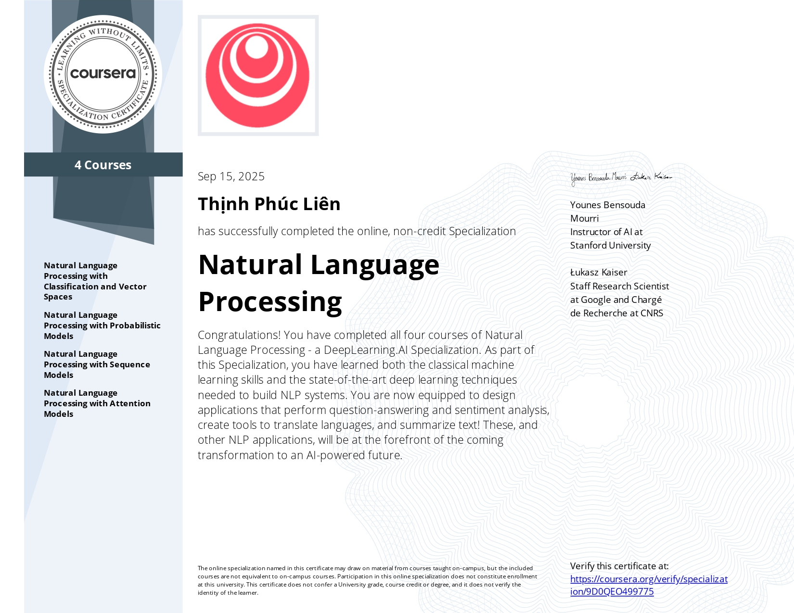
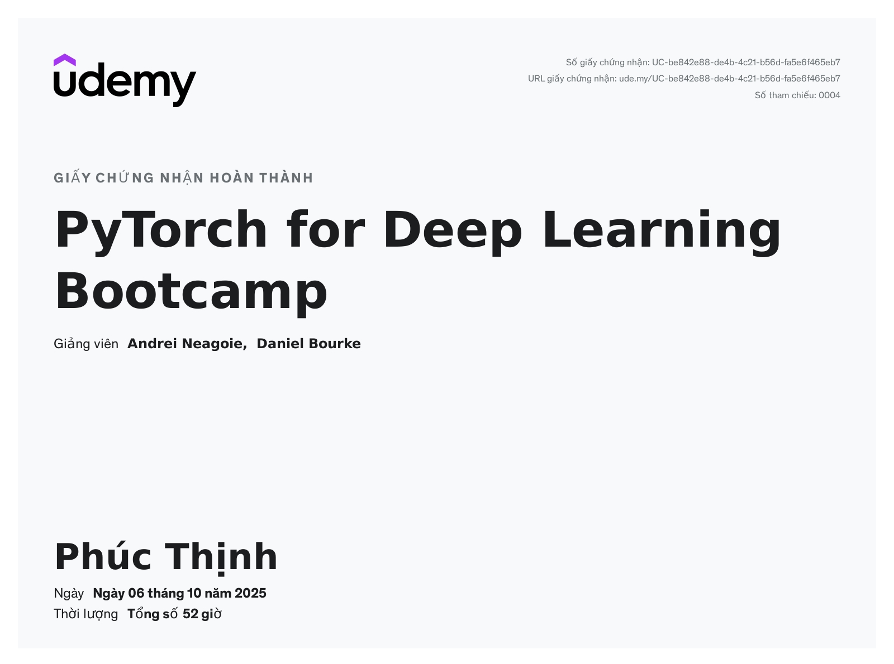
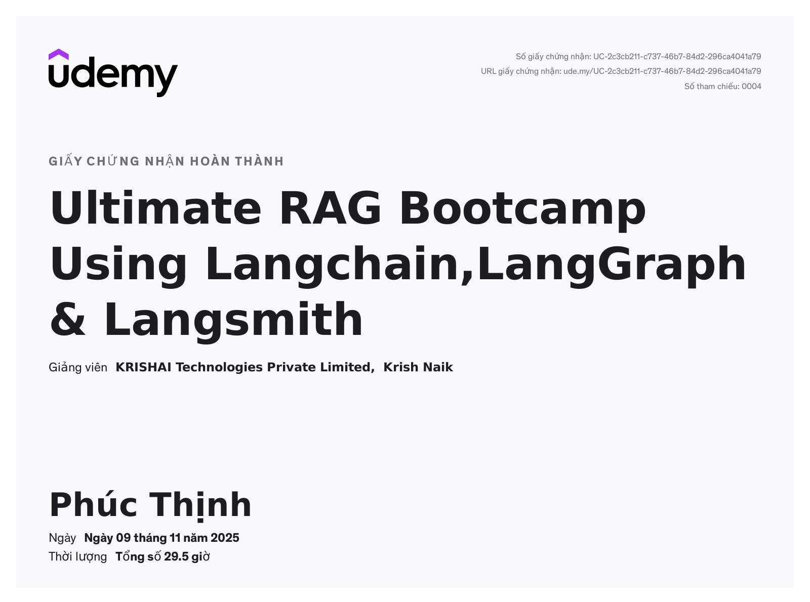
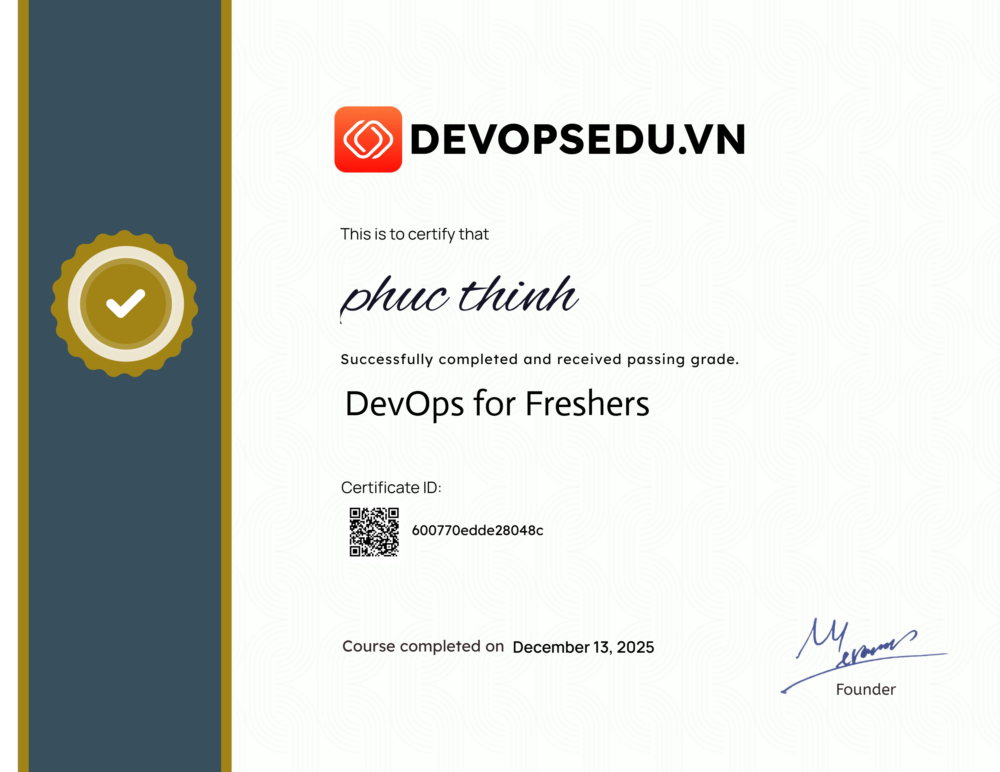

 

 

 

 

---
- 👋 Hi, I’m Thinh
- 👀 I’m interested in Natural Language Processing topic
- 🌱 I’m currently learning computer science at UIT
- 📫 How to reach me :https://www.facebook.com/ma.hoang.9693001 
- ⚡ Fun fact: I love game, anime and traveling
- 🤗 My Hugging Face accounts: https://huggingface.co/ThinhLLM

## 💻 Tech Stack

  <!-- C++ -->
  
  <!-- Python -->
  
  <!-- Git -->
  
  <!-- MySQL -->
  
  <!-- NumPy -->
  
  <!-- Matplotlib -->
  
  <!-- Scikit-Learn -->
  

  
  <!-- Hugging Face (PNG fallback) -->
  

  

  

  

  

## 🔥 GitHub stats: 

  

  

   
  <b>Note:</b> Top languages is only a metric of the languages my public code consists of and doesn't reflect experience or skill level.

<!---
TheChaser-life/TheChaser-life is a ✨ special ✨ repository because its `README.md` (this file) appears on your GitHub profile.
You can click the Preview link to take a look at your changes.
--->
