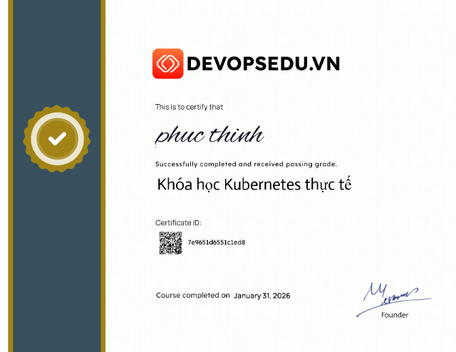
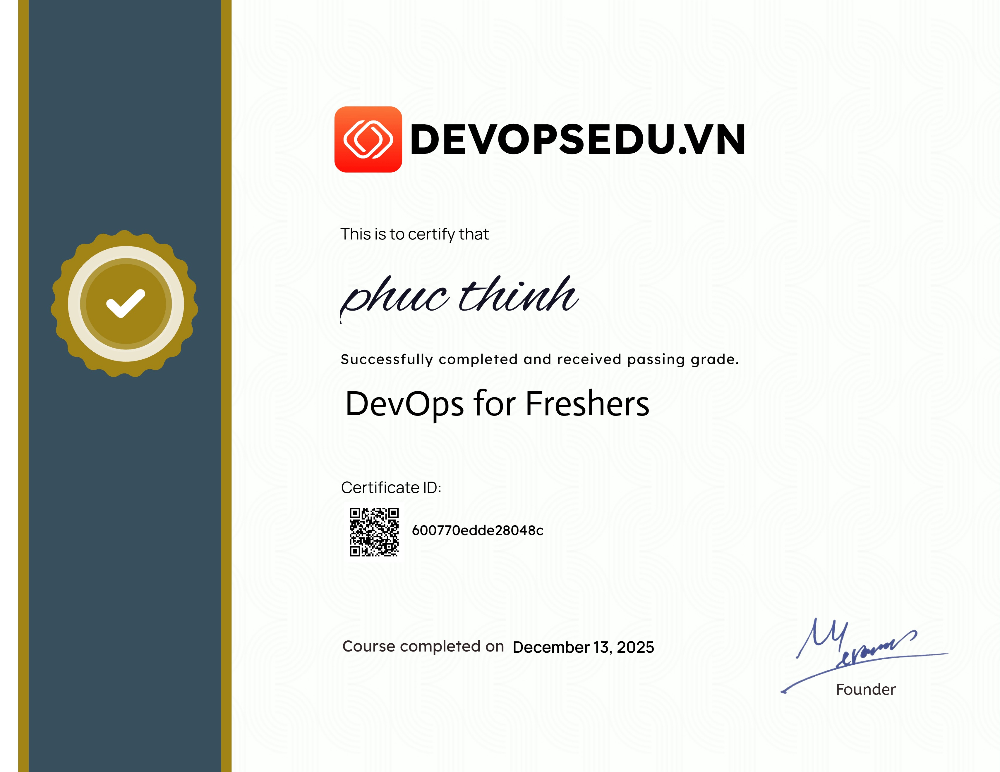
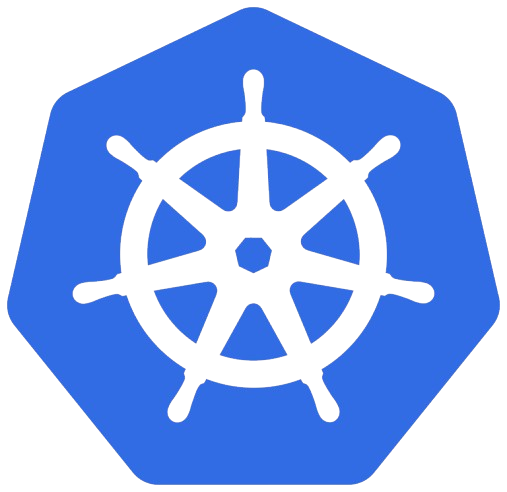
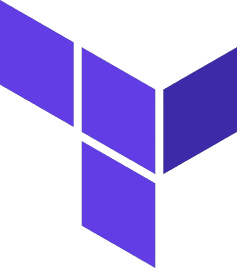

- 👋 Hi, I’m Phuc Thinh Lien
- 👀 I’m interested in Cloud Computing and System Design topic
- 🌱 I’m currently learning computer science at UIT
- 📫 How to reach me :https://www.facebook.com/ma.hoang.9693001
-  💼 My LinkedIn: https://www.linkedin.com/in/ph%C3%BAc-th%E1%BB%8Bnh-673416303/
- ⚡ Fun fact: I love game, anime and traveling
- 🎯 Current goal: Get an Intern Cloud/DevOps Engineer job

 

 

---

## 💻 Tech Stack

  <!-- C++ -->
  
  <!-- Python -->
  
  <!-- Git -->
  
  <!-- AWS -->
  
  <!-- Docker -->
  
  <!-- K8s -->
  
   <!-- GitHub Actions -->
  
  <!-- Terraform -->
  

## 🔥 GitHub stats: 

  

  

   
  <b>Note:</b> Top languages is only a metric of the languages my public code consists of and doesn't reflect experience or skill level.

<!---
TheChaser-life/TheChaser-life is a ✨ special ✨ repository because its `README.md` (this file) appears on your GitHub profile.
You can click the Preview link to take a look at your changes.
--->
